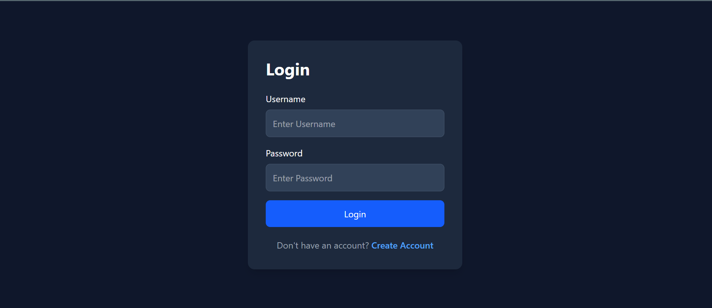
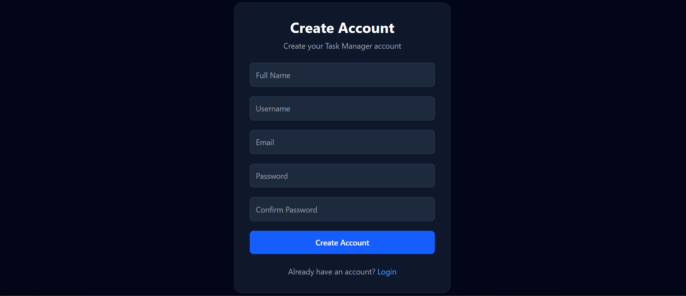
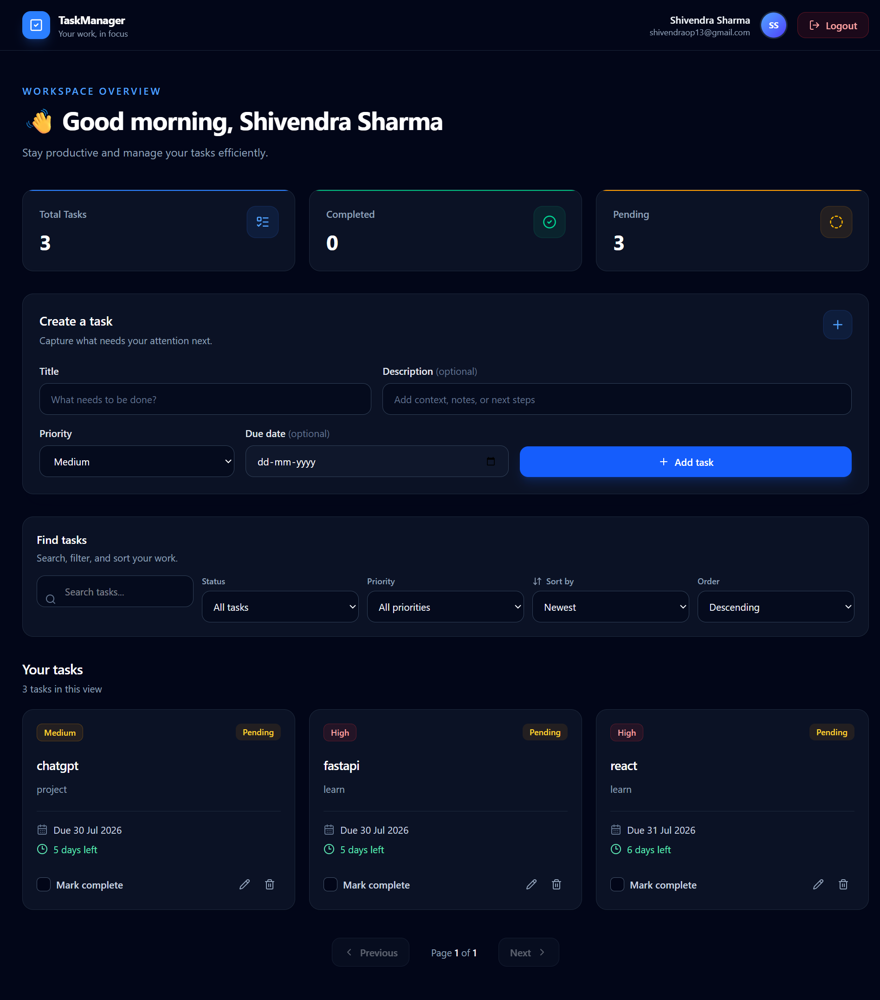
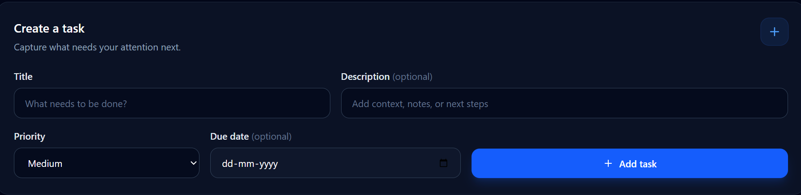
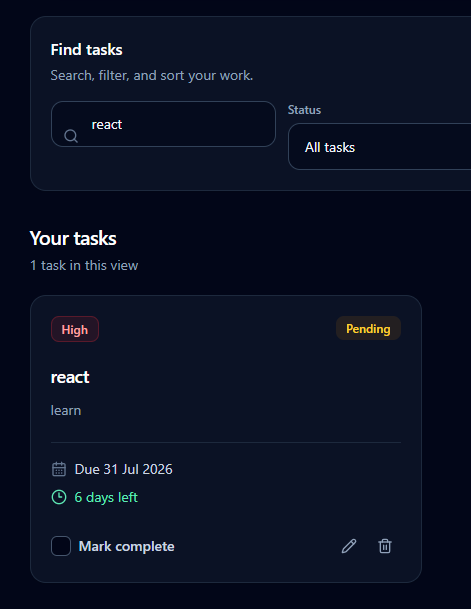
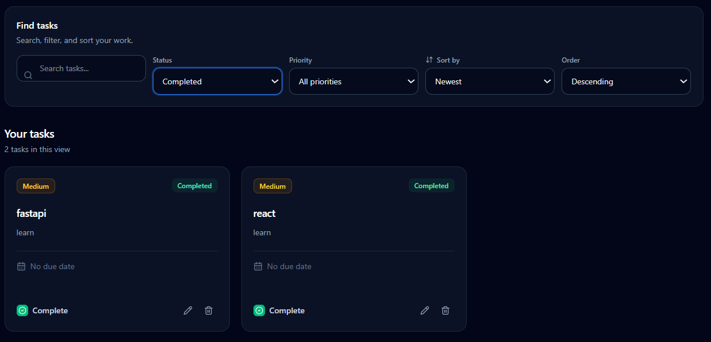
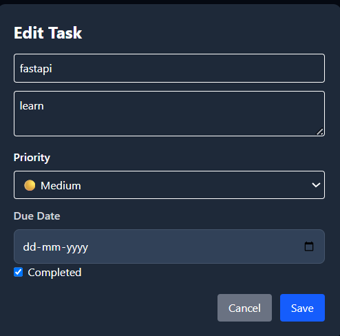
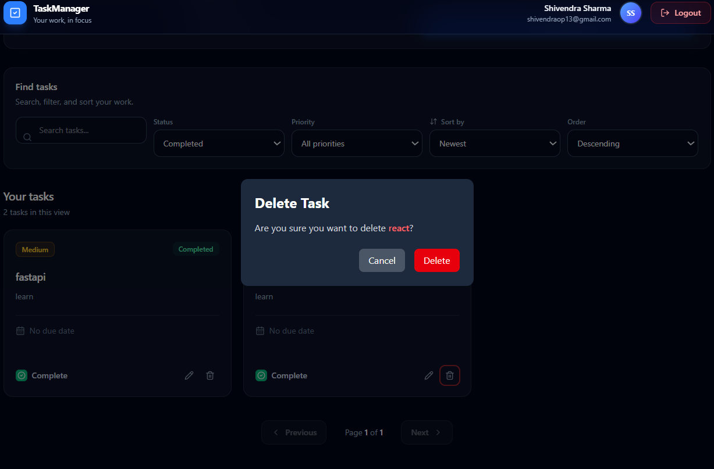
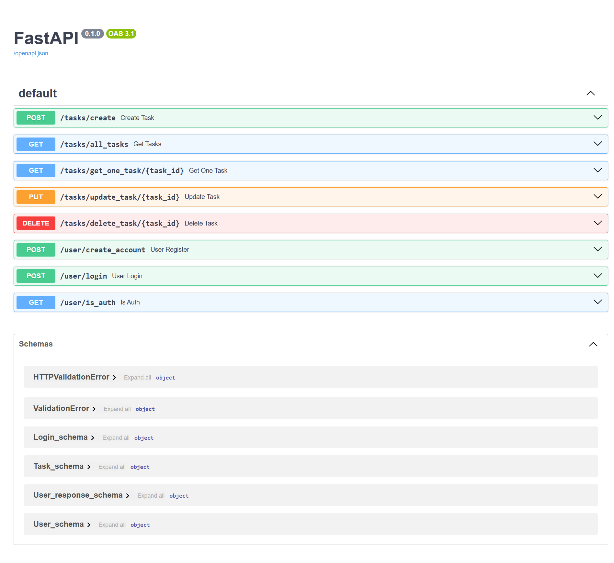

# 🚀 Task Manager

A full-stack Task Manager web application built with **React + FastAPI + PostgreSQL**. It provides secure JWT authentication and complete task management features including create, update, delete, search, filtering, and email integration.

---

## 🌐 Live Demo

**Frontend:** https://task-manager-pi-dusky-20.vercel.app

**Backend:** https://task-manager-3hfi.onrender.com

**API Documentation (Swagger):** https://task-manager-3hfi.onrender.com/docs

---

# ✨ Features

- 🔐 JWT Authentication
- 👤 User Registration & Login
- ➕ Create Task
- ✏️ Update Task
- 🗑 Delete Task
- 🔍 Search Tasks
- 🎯 Filter Tasks
- ✅ Mark Task as Completed
- 📧 Email Integration
- 🔒 Protected Routes
- 📱 Responsive UI

---

# 🛠 Tech Stack

### Frontend

- React
- Vite
- Tailwind CSS
- Axios
- React Router

### Backend

- FastAPI
- SQLAlchemy
- PostgreSQL (Neon)
- JWT Authentication
- FastAPI Mail

### Deployment

- Vercel
- Render
- Neon PostgreSQL

---

# 📁 Project Structure

```text
task_manager
│
├── backend
│
├── frontend
│
├── README-assets
│
└── README.md
```

---

# 📸 Screenshots

## Login



---

## Register



---

## Dashboard



---

## Create Task



---

## Search Task



---

## Filter Task



---

## Update Task



---

## Completed Task


---

## Delete Task



---

## Swagger API



---

# ⚙️ Installation

## Clone Repository

```bash
git clone https://github.com/shivendra1312/task_manager.git
```

### Backend

```bash
cd backend

python -m venv env

env\Scripts\activate

pip install -r requirements.txt

uvicorn main:app --reload
```

### Frontend

```bash
cd frontend

npm install

npm run dev
```

---

# 🔑 Environment Variables

Backend `.env`

```env
DB_CONNECTION=your_database_url

SECRET_KEY=your_secret_key

ALGORITHM=HS256

EXP_TIME=60

MAIL_USERNAME=your_email

MAIL_PASSWORD=your_password
```

---

# 🚀 Future Improvements

- Dark Mode
- Task Categories
- Due Date Notifications
- Drag & Drop Tasks
- File Attachments
- Profile Management

---

# 👨‍💻 Author

**Shivendra Sharma**

GitHub:
https://github.com/shivendra1312

---

## ⭐ If you like this project, don't forget to give it a Star.
